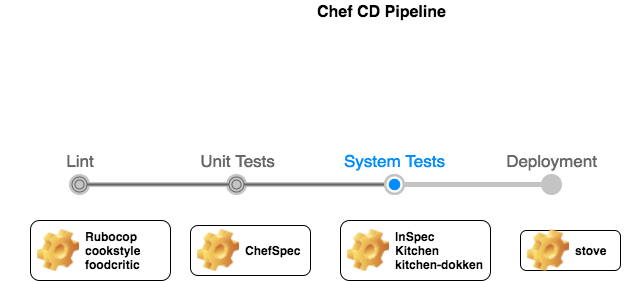
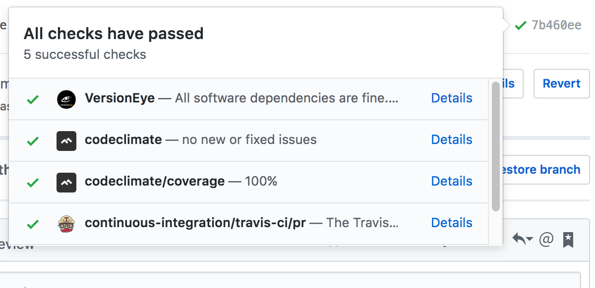

# Journey to chef community cookbook

Recently we developed a chef community Library cookbook for installing and configuring Atlassian Bitbucket Server. We wanted to share the learnings and decisions we had during this journey. We hope this will be useful for anyone who is new to chef and just starting to develop a chef cookbook.

## Why we chose to develop a new cookbook?

Before we think of developing any cookbook in chef the first step is to check for an existing cookbook on [Supermarket](https://supermarket.chef.io/), we just did that and interestingly found no results for 'bitbucket' , then we tried 'stash' (former name for bitbucket) and found only one cookbook [stash](https://supermarket.chef.io/cookbooks/stash) , but it had no support for 5.x version. The next thought was we should contribute to the stash cookbook. But after spending a bit of time with the stash, we observed:

- It was trying to solve too many things in one cookbook. For instance it included options to install the DB. I would ideally use it as a different cookbook.
- Its chef dependancy was old.

Hence we chose to write a simple cookbook that only installs and manages bitbucket without too many other dependancies. We have to give due credits to the [stash](https://supermarket.chef.io/cookbooks/stash) cookbook developers, from who many aspects of this cookbook was inspired from.

## Deciding between custom resource and recipe

Now that we knew we had to develop our own cookbook, we first approached the solution as a recipe. But again it gets so inflexible for reuse or to make it available as a community cookbook. The only way to customise some of the behavior is by managing the attributes of the node that gets used by the recipe. This means the person who is writing a wrapper cookbook has very little freedom on how to externalise variables. I also find wrapper cookbooks to be less readable when there are `include_recipe` in them.
In a wrapper cookbook, I like to read:

```Ruby
git_client 'default' do
  action :install
end

```

Instead of:

```Ruby
include_recipe "git::default"
```

So we decided to look at some of the featured and most followed cookbooks on supermarket. Many of them defined their own resources like [docker](https://supermarket.chef.io/cookbooks/docker) or [mysql](https://supermarket.chef.io/cookbooks/mysql). It was clear we wanted to provide our own bitbucket resources rather than recipes.

## LWRP,HWRP,Libraries or Custom Resources?

Yes, thats right! Not there are 2 choices to write your own chef resource:

- develop a cookbook including `LWRP`,`HWRP`,Libraries
- `custom_resources`

Until `chef-12.4` the chef way of developing cookbooks was using a combination of `LWRP`,`HWRP` and Libraries. But in relese `chef-12.5` chef introcuded `custom_resources` as a better and simpler way of developing chef resources. Folks at Chef have done a great job providing some sample cookbooks as reference in the [Chef Communicty Cookbook Repo](https://github.com/chef-cookbooks). We found [tomcat](https://github.com/chef-cookbooks/tomcat) implementation very neat and easy to understand. We strongly recommend any one starting out with cookbook development to start with this as a reference. Also checkout this awesome presentation by [TimothySmith](https://www.slideshare.net/TimothySmith56/chefconf-2016-writing-compossible-community-cookbooks-using-chef-custom-resources) on developing chef custom resources. These two resources were invaluable for us to undestand and start thinking and implementing our first community cookbook.

Our preferred approach was [**custom_resources**](https://docs.chef.io/custom_resources.html). This is the new way to implement [**LWRP**](https://docs.chef.io/custom_resources_notes.html). This lets author of the wrapper cookbook to use these resources in his recipe like any other chef resource passing whatever is needed. For instance:

```Ruby
bitbucket_install 'bitbucket' do
  jre_home "#{node['java']['java_home']}/jre"
  jvm_args "some_data_bag_item"
end
```

## Chef Way

Using chef generate command to generate the Project structure was easy. The interesting part was building it with _Quality_, _testability_, _deployability_.
Chef's ecosystem is itself evolving and so are the toolsets for developing, testing and deploying.
Since Chef itself is mostly built using Ruby, lot of Ruby development practices also come in handy while developing Chef Cookbook. Few worth mentioning are **Bundler**, **Rake**, **Rubocop** and **RSpec**. If one knows these tools developing Quality Chef Cookbooks will be much faster and better.



### How do I TDD a cookbook?

We mostly followed Test Driven approach and started out with unit tests, then implementation, followed by System tests (Using [**InSpec**](https://www.inspec.io/) with [**kitchen**](http://kitchen.ci/)). We were able to do changes and iterate quickly using this approach.
While [**kitchen**](http://kitchen.ci/) is an amazing tool, we found [**chefspec**](https://github.com/chefspec/chefspec) to be better for TDD. It has fast feedback while development. We are very impressed with [**chefspec**](https://github.com/chefspec/chefspec) as a tool to unit test cookbooks. It is very helpful to test your intentions in a `recipe`/`custom_resource` without having to create and destroy containers evertime you test.
Since we have decided to use `custom_resource`, we needed to unit test what the `custom_resource` executes internally. It was useful to utilise `step_into` option to unit test the intentions of the `custom_resource` itself.

When a wrapper cookbook uses this `custom_resource`, it should not be testing what the `custom_resource` does internally. It should only test the `custom_resource` from outside. Much like:

```Ruby
it 'installs bitbucket server' do
  expect(chef_run).to install_bitbucket('bitbucket')
    .with_jre_home('/usr/lib/jvm/java-8-oracl/jre')
end
```

We can enable such tests using `matchers` like:

```Ruby
def install_bitbucket(resource_name)
  ChefSpec::Matchers::ResourceMatcher.new(:bitbucket_install, :install, resource_name)
end
```

It is also important that the `matchers` of the `custom_resource` are exposed as `libraries`. That was authors of wrapper coobook can use them to unit test `custom_resource` without creating `matchers` for them.

### Test Coverage

This is something that gets tricky in cookbooks. While `SimpleCov` is a good tool for plain ruby, it is not as useful for using with [**chefspec**](https://github.com/chefspec/chefspec). I tend to agree with [Seth Vargo](https://sethvargo.com/chef-recipe-code-coverage/) that `SimpleCov` may not be the best way to track coverage for a recipe. Although the [**chefspec**](https://github.com/chefspec/chefspec)'s way of describing coverage (using `at_exit { ChefSpec::Coverage.report! }`) does not produce fancy reports, it is more useful in terms of counting resources touched by test cases vs lines executed.
Note: the blog post is quiet old and some of the things described about generating `./.coverage/results.json` are outdated.

### Style/Linting

It goes without saying that [**foodcritic**](http://www.foodcritic.io/) and [**Rubocop**](https://github.com/bbatsov/rubocop) are a must have. [**foodcritic**](http://www.foodcritic.io/) helped us get some of the non-functional aspects of a cookbook right, like:

- having a correct issue/source urls.
- The format of the supported OS version
- generally making sure the details in `metadata.rb` is usable and meaningful when published to supermarket.

Using plain [**Rubocop**](https://github.com/bbatsov/rubocop) was a bit more interesting. The first `chef exec rubocop -a` came up with over 100 errors(many of them auto-corrected). We quickly realised is using plain rubocop was annoying with silly warnings and errors on files like `metadata.rb`. Using `rubocop -a` option will change file permissions declaration like `00755` to `0o0755` in recipes. These are very common problems in every cookbook and I should not be configuring `.rubocop.yml` in every one of them. We found it useful to use [**cookstyle**](https://github.com/chef/cookstyle) gem which is opinionated [**Rubocop**](https://github.com/bbatsov/rubocop) for chef cookbook development. None of the nonsense of plain [**Rubocop**](https://github.com/bbatsov/rubocop). Just what you may need for cookbook development.

### System testing and TravisCI

This stage is a 2 step Process:

- Step I  test/cookbooks/test : Since the cookbook is just a bunch of resources, we need a test recipe that executes these resources.
- Step II test/smoke/default  : The InSpec tests Post deployment.

Using [**kitchen**](http://kitchen.ci/) with [**docker**](https://github.com/test-kitchen/kitchen-docker) was more enticing for us until we needed some things that are not designed to run in docker. For instance, getting `systemd` service installed in docker is not straight forward. Though vagrant/virtualbox is slightly slower than docker, it can be used with kitchen to test these scenarios.
I am a fan of CI and I love PullRequest builders. The most common CI tool available for opensource repos is [**TravisCI**](https://travis-ci.org/). But if we are to use [**kitchen**](http://kitchen.ci/) tests in [**TravisCI**](https://travis-ci.org/), we have to refrain from vagrant/virtualbox. This is because travis build environments would not support it. We had to restrict ourselves to docker. [**kitchen-dokken**](https://github.com/someara/kitchen-dokken) driver helped us come around this constraint.

### Checking dependancy updates

I generally prefer keeping dependancies (both cookbook and gem) as upto date as possible. This help in making sure upgrades are in small increments. The problem is following the updates of all the resources and tracking them against what is used. We found [**VersionEye**](https://www.versioneye.com) to be a good tool to track this on github PRs. It flags any outdated dependancies including `Gemfile`, `Berksfile` and `metadata.rb`. This prompts any commiter to review the version.



### Managing releases/Deployment

Just a quick google search reveals some organised way of maintaining change logs and releasing to supermarket. We found [**github_changelog_generator**](https://github.com/skywinder/github-changelog-generator) and [**stove**](https://github.com/sethvargo/stove) to be useful Gems to use.
[**stove**](https://github.com/sethvargo/stove) makes sure you dont do silly mistakes like trying to release from a branch other than master. It also makes sure there are no local changes before releasing. It also tags the repo with the release version.
[**github_changelog_generator**](https://github.com/skywinder/github-changelog-generator) lets you generate automated changelog from git history.
